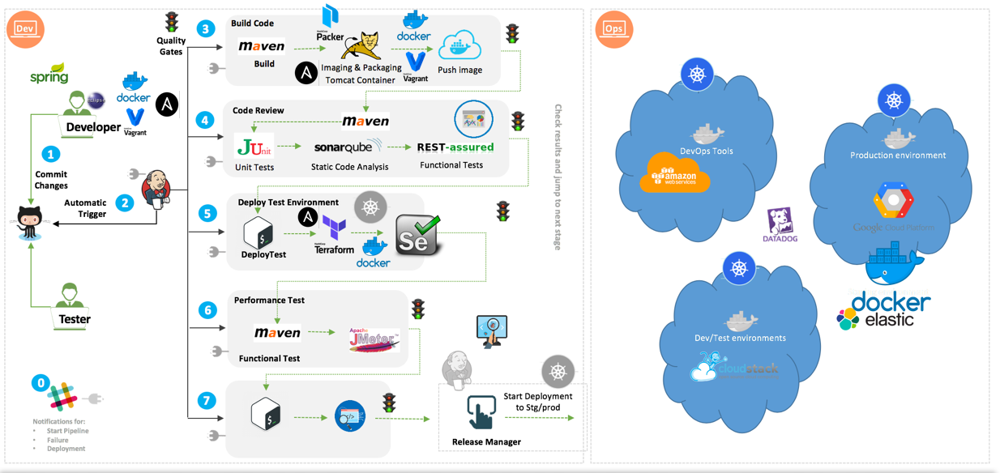
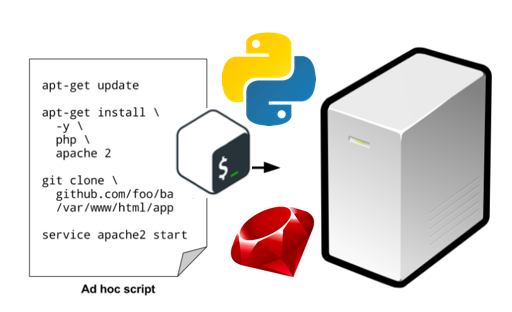
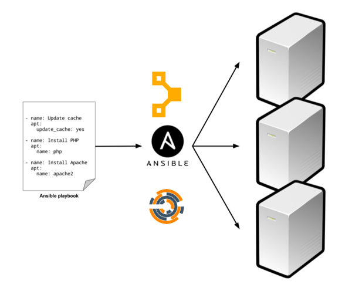
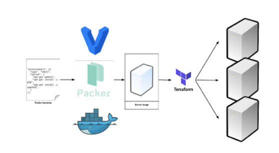
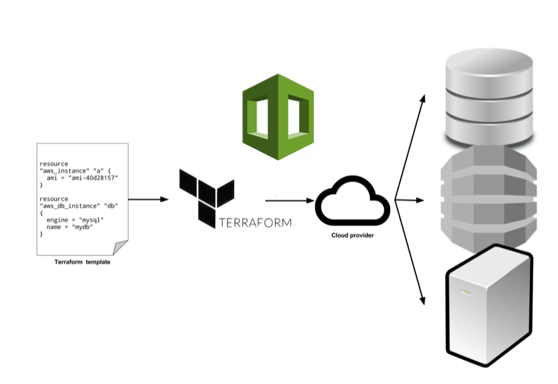
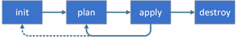
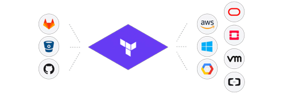

## Who would be interested in this talk?

* SysAdmins
* Operation Engineers
* Release Engineers
* SRE
* DevOps Engineers
* Infrastructure Developers
* Full Stack Developers
* IT Professors
* IT Students

## What is infrastructure as code (IaC)?

* IaC is not just automation, It extends beyond that!!

* IaC requires applying DevOps practices to automation scripts.
    * Can be redeployed on multiple servers.
    * Can be rolled back in case of problems.
    * Can be engaged by both operations and development teams.

## Category of IaC tools

## Category of IaC tools
* Ad Hoc Scripts

## Category of IaC tools
* Configuration Management Tools

## Category of IaC tools
* Templating Tools  

## Category of IaC tools
* Provisioning Tools

## Infrastructure paradigms:
### Mutable VS Immutable

* **_mutable infrastructure_** servers are continually updated and modified in place

* **_Immutable infrastructure_** servers are never modified after they're deployed. 

## Benefits of infrastructure as code (IaC)

## Benefits of infrastructure as code (IaC)

* Self-service
* Speed and safety
* Documentation
* Version control
* Validation
* Reuse
* Happiness

## Tools and Use Cases

## Packer

* Is easy to use and automates the creation of any type of machine image.
* It embraces modern configuration management by encouraging you to use automated scripts to install and configure the software.
* Packer brings machine images into the modern age, unlocking untapped potential and opening new opportunities.

## Terraform

## Terraform

* is an open source IaC tool.
* was developed by Hashicorp
* is a tool for building, changing, and versioning infrastructure safely and efficient.

## Terraform

* Terraform has these three principal simple steps:

* Init
* Plan
* Apply

## Terraform Providers

## Terraform Providers

## Terraform Providers
* can be used to manage multi-cloud
* can conbine multiple providers into a single workflow.
* There are more than 100 providers and those individually can manage over a thousands resources.
* Providers are responsible to provide API interaction.
